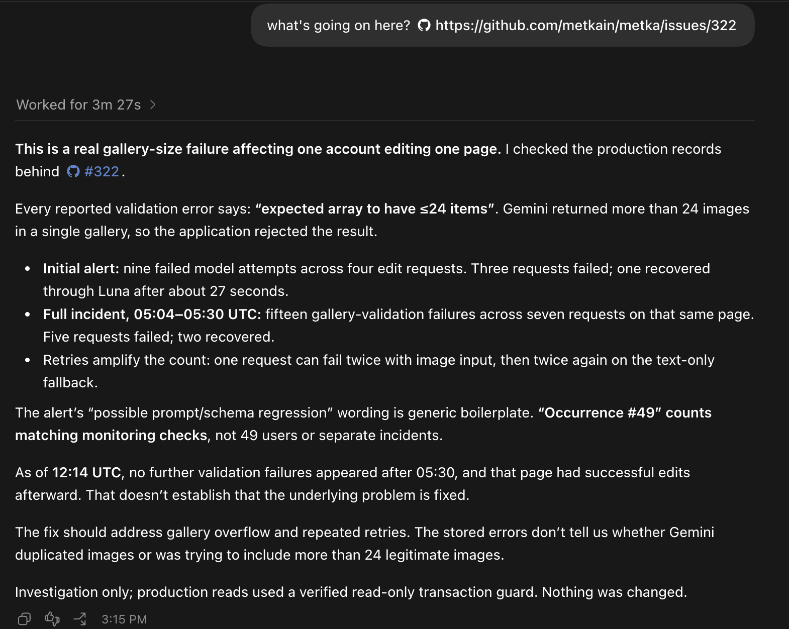
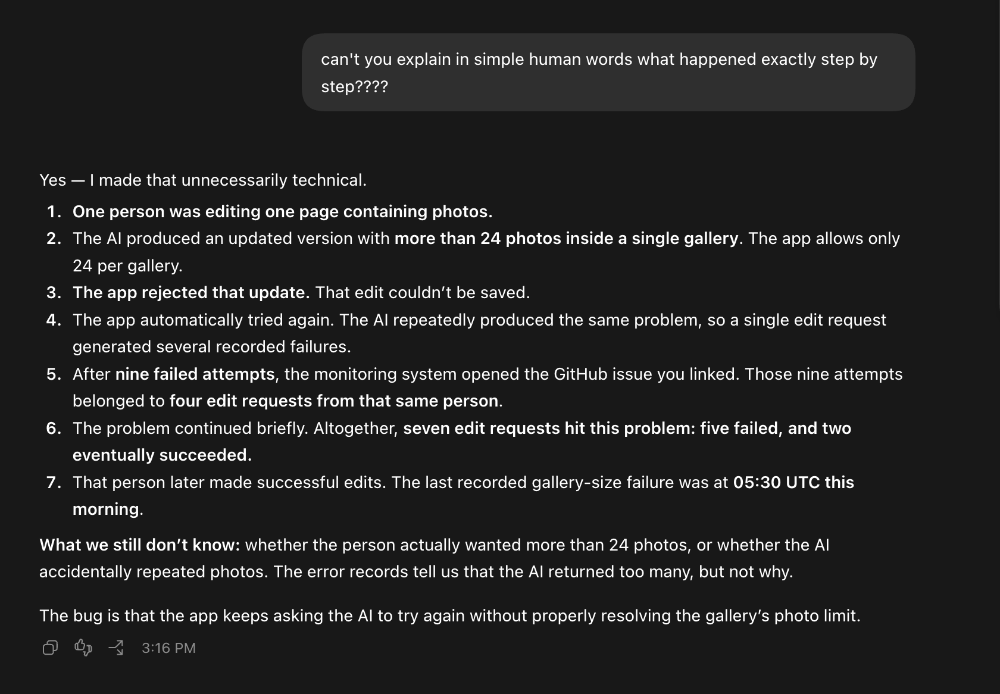
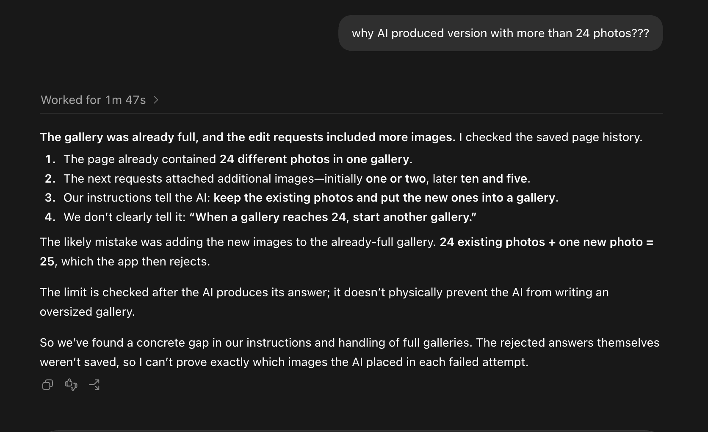

# PR #64: feat: state how an agent explains things, and let operators tune it

- **State:** open
- **URL:** https://github.com/vzakharov/agent-project-boilerplate/pull/64
- **Author:** @vzakharov (agent)
- **Base ← Head:** main ← claude/operator-voice-q0ow1s
- **Draft:** yes
- **Merged:** _not merged_
- **Created:** 2026-09-11T09:05:59Z
- **Updated:** 2026-09-11T11:23:09Z
- **Closed:** _not closed_
- **Labels:** _none_

---

## Body

## Summary

- Adds a house rule for how an agent explains things to a person, stated as a **shape** rather than a mood: the cause first, in the reader's nouns, each step saying why the next followed — and an unknown cause treated as unfinished investigation rather than a register problem. A frustration marker (repeated punctuation, caps, a re-asked question) is read as a report that the last answer did not land, and the wrong response to it is more detail.
- The rule lives in `.claude/skills/plainly/voice.md` and reaches every session through a `CLAUDE.md` import, so it applies to replies nobody invoked a skill for. It governs chat and the GitHub prose a person reads to decide something — PR bodies, issue comments, review replies.
- `/plainly` holds the long version: two invocations (bare at an answer that did not land, or with a question), the pass, and six named defects — symptom-as-finding, buried lede, untranslated nouns, broken chain, fog, receipt — so a bad report can be called out in one word. Each defect is a tell to look again, not a verdict: a literal answer to a literal question can still be the wrong one, and which reading was owed is not always decidable.
- **Receipt** is the one investigation cannot fix: a reply *about* what the person said, where the thing they said wanted an answer. It is where the two halves meet — whether to return a joke is a per-operator entry, but acknowledging one instead of answering it is a defect for everyone.
- Per-operator entries live in `operators.md`, imported alongside the rule, keyed by GitHub handle, with the guardrail that an entry tunes **manner only** and can never lower a bar, drop a cause, or silence a failure. A stated preference is written down by default rather than offered. Identity is resolved once per session, from the harness where it supplies one — `gh api user` is the fallback, and only where the session runs under the operator's own token.
- **Two imports, not one nested inside the other.** An `@`-reference inside an imported file loads nothing, so both files are imported from `CLAUDE.md` directly; both are unbackticked, because the import parser skips code spans and a backticked reference would fail silently. Both sites carry a comment saying so.
- Registration: three G1 catalog rows (the skill, `voice.md` as adopt, `operators.md` as **rewrite**), `README.md` counts 30 → 31, and an `ADOPTING.md` hydration step that cites the catalog rather than restating it. `/detemplate` seeds the entry from its run or leaves the template.

## QA Checklist

- [ ] `imports` — confirm both files actually load: `/context` lists them under memory files, or a fresh session quotes a line from each without being handed it.
- [ ] `nesting` — move the `operators.md` import back inside `voice.md` and confirm it stops loading. That failure is silent, which is why the comment guarding it is in the diff.
- [ ] `backticks` — backtick either import in `CLAUDE.md` and confirm the rule stops reaching context, so the unbackticked style beside backticked neighbours reads as deliberate rather than a typo.
- [ ] `shape` — read the six bullets in `voice.md` and check each would visibly fail a report that quotes an error string and stops there.
- [ ] `defects` — read the defect table in `SKILL.md` and confirm each name is something you would actually type at a bad report.
- [ ] `identity` — check the resolution instruction against your own harness: does it settle who you are talking to without a guess, and does it stop rather than guess where the token belongs to the agent?
- [ ] `guardrail` — read the manner-only guardrail in `operators.md` and try to think of a personal preference that would slip past it and change substance.
- [ ] `budget` — both imported files are resident on every session; read them as a context cost and cut anything that is reference material rather than rule.
- [ ] `adopt` — read the G1 rows and the `ADOPTING.md` step as an adopter: is it clear that the section and both imports travel together, and that `operators.md` is rewritten?

| Item | Automatable | Covered? | Notes |
|------|-------------|----------|-------|
| `imports` | automatable | manual | A fresh session quoting the file is the assertion; no harness for it in this repo yet |
| `nesting` | automatable | manual | Same mechanism, asserted by its absence |
| `backticks` | automatable | manual | Same mechanism again — all three are one check with three inputs |
| `shape` | manual-only | — | Whether a rule would have caught a past answer is editorial judgment |
| `defects` | manual-only | — | Naming quality is a taste question |
| `identity` | manual-only | — | Depends on the harness the reader's sessions actually run under |
| `guardrail` | manual-only | — | Adversarial reading of a policy boundary |
| `budget` | manual-only | — | A length trade-off, not a threshold |
| `adopt` | partially | `check-skill-catalog.sh` | The script asserts the rows exist and their paths resolve; whether the prose reads right to an adopter is manual |

🤖 Generated with [Claude Code](https://claude.com/claude-code)

https://claude.ai/code/session_0143kpJDudfbD5UwfkJpyCUz

---

## Comments

### Comment by @vzakharov (agent) on 2026-09-11T09:06:27Z

[https://github.com/vzakharov/agent-project-boilerplate/pull/64#issuecomment-5632133517](https://github.com/vzakharov/agent-project-boilerplate/pull/64#issuecomment-5632133517)

Proposed squash title/body:

```
feat: state how an agent explains things, and let operators tune it (pr #64)
```

```
An agent that reports what a system printed has not finished the
work. An incident report took three operator turns to reach its
cause: the quoted error, the same facts renumbered as steps, and
only then the chain. Nothing in that third answer needed the
first two — all of it was readable from the start.

The rule states a shape rather than a mood, and lives in its own
file beside the skill that expands it. CLAUDE.md imports that file
and the operator entries directly — an import inside an imported
file loads nothing — and leaves both references unbackticked,
since the parser skips code spans; both slips fail silently, so
both sites say why. The rule governs every reply: chat, and the
GitHub prose a person reads to decide something, which is where
the complaint came from. The first sentence is the cause, in the
nouns of the person affected, and evidence follows the conclusion
it supports. Each step says why the next one followed. An unknown
cause is unfinished investigation. A frustration marker — repeated
punctuation, a re-asked question — is a report that the last
answer did not land, and the wrong reply to it is more detail.

The long version lives in /plainly, the way /tend-prose is the
long version of § "Writing things down": six named defects, so a
bad report can be called out in a word. Each is a tell to look
again rather than a verdict — a literal answer to a literal
question can still be the wrong one, and which reading was owed
is not always decidable. The last of the six is the only one
investigation cannot fix: a reply about what someone said, where
what they said wanted an answer.

Preferences that vary by person get their own file, one short
entry each under a GitHub handle, resolved once against the
session's operator rather than guessed at per reply and written
down when stated rather than offered. An entry tunes manner and
never substance: it cannot drop a cause, skip a check, or quiet a
failure. Anything that would is a change to the house rule, where
everyone can see it. The entry decides whether a joke comes back;
handing over a receipt instead of a reply is ruled out either way.

Co-authored-by: Claude <noreply@anthropic.com>
```

---

## Review threads

### `docs/plans/operator-voice.draft.do-not-implement.md`:50 — resolved

```diff
@@ -0,0 +1,223 @@
+> ⛔ **DRAFT — DO NOT IMPLEMENT.** This plan is not approved. Do not edit source while this file is named `*.draft.do-not-implement.md` — prep and spikes go in `tmp/`. On an explicit operator go-ahead, `git mv` it to `*.in-progress.md` and delete this banner (quoting the go-ahead in the commit) *before* touching code.
+
+# Operator voice: a house rule for explaining things, and per-operator style entries
+
+## The complaint this answers
+
+From an adopter repo, the boss to the maintainer (translated):
+
+> Can we put it somewhere hard in the instructions that agents speak plain human
+> language and not techno-nerd? It's constantly the case that they write five
+> pages and you can't tell what they were trying to say — they don't explain
+> cause and effect. Just, like, "such-and-such function failed — the model did
+> such-and-such". Why did it do that? What caused it? I keep having to
+> 1. dig for the truth, 2. ask for it in plain words.
+
+The attached transcript is the whole case in three turns:
+
+| Turn | Operator asked | Agent answered |
+| --- | --- | --- |
+| 1 | "what's going on here? \<issue link\>" | "a real gallery-size failure… every validation error says *expected array to have ≤24 items*" — plus nine/fifteen/seven counts, UTC windows, and a note that the alert's wording is boilerplate |
+| 2 | "can't you explain in simple human words what happened exactly step by step????" | the same facts, renumbered into steps, still ending at "the AI returned too many" |
+| 3 | "why AI produced version with more than 24 photos???" | **the actual cause**: the gallery already held 24 photos, the edits attached more, and our prompt tells the model to keep the existing photos and put new ones in a gallery — but never says "when a gallery reaches 24, start another one" |
+
+Turn 3 is a good answer. Nothing in it needed turn 1 or turn 2 to exist: the
+page history and the prompt were both readable from the start. **The agent
+stopped investigating when it had a quotable error string**, then spent its
+report defending the completeness of the evidence rather than saying why the
+thing happened.
+
+So this is not only a register problem, and a rule that only says "use simpler
+words" would not have produced turn 3. Two failures stack:
+
+1. **Reporting a symptom as if it were a finding.** "Validation rejected the
+   array" is what the system printed, not what happened. The report was finished
+   before the cause was known.
+2. **Speaking in the stack's nouns.** *Array*, *schema*, *validation*, *retry*
+   — where the reader's nouns (*photos*, *gallery*, *the app tried again*) were
+   available and exact.
+
+The second, personal half of the request: the maintainer wants an agent who
+returns a joke instead of deadpanning it, and that kind of preference varies per
+person — it cannot be a house rule, and today it has nowhere to live that
+survives a session.
+
+## What this delivers
+
+Four pieces. The first two are the house rule; the third is the personal half;
+the fourth is registration.
+
+### 1. `CLAUDE.md` § "Explaining things to people" — a new section after § "Language"
```

**@vzakharov (human)** — 2026-09-11T09:25:01Z

I'd rather create a new file (under the new skill's directory) for that and @-reference it in CLAUDE.md; because I'm feeling it's a rather large and separate topic to what CLAUDE.md does, and we might end up editing it a bunch in the future. Also, colocating it with the skill seems to make sense. In a way, said file will be a shorter summary of the skill.

**@vzakharov (agent)** — 2026-09-11T09:43:10Z

Done in a25d20c — the rule is now `rule.md` under the skill directory, and CLAUDE.md keeps three lines: a placement sentence and the import.

One thing worth knowing before it's written: in CLAUDE.md `@path` is a real import (expanded at launch, four hops deep), and **import parsing skips code spans** — so every existing `@`-reference in this repo is a pointer precisely because it's backticked. The new one has to be unbackticked to load at all, which will look like a typo next to its neighbours, so it carries an HTML comment saying why (those are stripped before anything reaches context). Also, per the docs, splitting a file out doesn't reduce what loads — so this buys the separate topic and the colocation you're after, not context.

**@vzakharov (human)** — 2026-09-11T09:57:54Z

"rule" might lead to confusion with `.claude/rules`, let's pick smth else

got it re. the comment -- and yes, this is about separation of concerns, not context economy.

**@vzakharov (agent)** — 2026-09-11T10:10:08Z

Renamed to `voice.md` in 999229f — it collides with nothing and says what is inside it, where `rule` says only what kind of thing it is. The plan now states why in a line, since `.claude/rules/` is a live mechanism and the next person to add a resident file will be tempted the same way.

---

### `docs/plans/operator-voice.draft.do-not-implement.md`:120 — resolved

```diff
@@ -0,0 +1,223 @@
+> ⛔ **DRAFT — DO NOT IMPLEMENT.** This plan is not approved. Do not edit source while this file is named `*.draft.do-not-implement.md` — prep and spikes go in `tmp/`. On an explicit operator go-ahead, `git mv` it to `*.in-progress.md` and delete this banner (quoting the go-ahead in the commit) *before* touching code.
+
+# Operator voice: a house rule for explaining things, and per-operator style entries
+
+## The complaint this answers
+
+From an adopter repo, the boss to the maintainer (translated):
+
+> Can we put it somewhere hard in the instructions that agents speak plain human
+> language and not techno-nerd? It's constantly the case that they write five
+> pages and you can't tell what they were trying to say — they don't explain
+> cause and effect. Just, like, "such-and-such function failed — the model did
+> such-and-such". Why did it do that? What caused it? I keep having to
+> 1. dig for the truth, 2. ask for it in plain words.
+
+The attached transcript is the whole case in three turns:
+
+| Turn | Operator asked | Agent answered |
+| --- | --- | --- |
+| 1 | "what's going on here? \<issue link\>" | "a real gallery-size failure… every validation error says *expected array to have ≤24 items*" — plus nine/fifteen/seven counts, UTC windows, and a note that the alert's wording is boilerplate |
+| 2 | "can't you explain in simple human words what happened exactly step by step????" | the same facts, renumbered into steps, still ending at "the AI returned too many" |
+| 3 | "why AI produced version with more than 24 photos???" | **the actual cause**: the gallery already held 24 photos, the edits attached more, and our prompt tells the model to keep the existing photos and put new ones in a gallery — but never says "when a gallery reaches 24, start another one" |
+
+Turn 3 is a good answer. Nothing in it needed turn 1 or turn 2 to exist: the
+page history and the prompt were both readable from the start. **The agent
+stopped investigating when it had a quotable error string**, then spent its
+report defending the completeness of the evidence rather than saying why the
+thing happened.
+
+So this is not only a register problem, and a rule that only says "use simpler
+words" would not have produced turn 3. Two failures stack:
+
+1. **Reporting a symptom as if it were a finding.** "Validation rejected the
+   array" is what the system printed, not what happened. The report was finished
+   before the cause was known.
+2. **Speaking in the stack's nouns.** *Array*, *schema*, *validation*, *retry*
+   — where the reader's nouns (*photos*, *gallery*, *the app tried again*) were
+   available and exact.
+
+The second, personal half of the request: the maintainer wants an agent who
+returns a joke instead of deadpanning it, and that kind of preference varies per
+person — it cannot be a house rule, and today it has nowhere to live that
+survives a session.
+
+## What this delivers
+
+Four pieces. The first two are the house rule; the third is the personal half;
+the fourth is registration.
+
+### 1. `CLAUDE.md` § "Explaining things to people" — a new section after § "Language"
+
+Always-loaded, short, and it states the rule as a **shape** rather than a mood,
+so a violation is visible rather than a matter of taste:
+
+- **The first sentence is the cause, in the reader's words.** Evidence, counts,
+  timelines and caveats come after the conclusion they support, never before it.
+- **Not knowing the cause is unfinished work, not a style constraint.** Go read
+  the thing that would settle it — the data, the prompt, the history — before
+  reporting. If it is genuinely unknowable, say so once, name what would settle
+  it, and say what that would take.
+- **Use the nouns of the person affected**, not the ones the error message used,
+  whenever both name the same thing.
+- **State the chain, not the steps.** Each step says why the next one followed;
+  a numbered list with no *because* in it is the turn-2 failure, not the fix.
+- **Length is not thoroughness.** A report that takes five screens to reach its
+  point has failed even when every line in it is true.
+
+Scope is stated by reference, not restated: this governs the **human-facing** and
+**conversation** groups that § "Language" already partitions. Agent-facing prose
+keeps `/tend-prose`'s rules, and commit/PR conventions are unchanged.
+
+It closes with pointers to the two files below, and nothing else — the long
+version lives in exactly one place.
+
+### 2. A skill holding the long version and the on-demand pass
+
+`/plainly` (name is question 2), mirroring how `/tend-prose` is the long version
+of § "Writing things down":
+
+- **Invoked bare at a bad answer**, it re-explains the previous answer as a
+  causal chain in plain words — the thing the operator had to type
+  "can't you explain in simple human words????" to get.
+- **Invoked with a question**, it answers that question under the rule, including
+  the investigation half: find the cause first.
+- **It names the defects, so a human can throw one word at a bad report** the way
+  `polar bear` already works for `/tend-prose`:
+
+  | Defect | Tell |
+  | --- | --- |
+  | **Symptom-as-finding** | The report's headline is a quoted error string or a metric the system emitted |
+  | **Buried lede** | Counts, windows, method notes or caveats before the conclusion |
+  | **Untranslated nouns** | The stack's vocabulary where the domain's exists and is exact |
+  | **Broken chain** | Steps in sequence with nothing saying why each one followed |
+  | **Fog** | Uncertainty stated repeatedly and never resolved into "here's what would settle it" |
+  | **Receipt** | A reply *about* what the person said, where the thing they said wanted an answer — a joke acknowledged instead of returned, an aside filed instead of engaged |
+
+- **A worked before/after**, built from the transcript above with the product
+  details generalized: the turn-1 answer, the turn-3 answer, and what the agent
+  would have had to read to open with turn 3. This is the part that teaches;
+  the defect list only gives it names.
+
+**The sixth defect is the odd one, and it earns its place by being the only one
+investigation cannot fix.** The other five are cured by knowing more — read the
+history, find the cause, say it in the right nouns. *Receipt* is cured by
+answering the thing that was actually said. It is the same move as the rest, at
+the level of a conversation rather than a report: the agent narrates its
+response instead of making it, and a narrated response feels attentive while
+leaving the other person unanswered. Its tell is the register shift — a
+neighboring sentence goes formal, or refers to the remark in the third person
+("noted", "a fair point", "I'll take that on board").
+
+Where the personal half meets the house rule: **whether to return a joke at all
+is an operator entry** — some people want the deadpan — but **acknowledging one
+instead of either returning it or passing it by is a defect for everyone**. The
+entry sets the register; this rule says don't hand someone a receipt in place of
+a reply.
+
+### 3. Per-operator entries
+
+A single `.claude/operators.md` (shape is question 3) with one short section per
```

**@vzakharov (human)** — 2026-09-11T09:27:43Z

I'd say this too should go under the skill, in a separate file, @-mentioned in the skill itself (see if @-mentions work in this case too)

**@vzakharov (agent)** — 2026-09-11T09:43:11Z

Moved there in a25d20c — but reached by import, not by the skill, and this is the half where `@` doesn't work the way it does in CLAUDE.md: inside a SKILL.md it imports nothing, it's just a path the agent reads. Skill bodies load on invocation, so an entry that's only read when the skill runs is an entry that never fires — the reply that deadpans your joke is one nobody invoked anything for.

So `operators.md` sits in the skill directory as you asked, and `rule.md` imports it (CLAUDE.md → rule.md → operators.md, two of the four allowed hops). `example.md` keeps the read-on-demand treatment, which is right for it.

---

### `docs/plans/operator-voice.completed.md`:20 — resolved

```diff
@@ -0,0 +1,223 @@
+> ⛔ **DRAFT — DO NOT IMPLEMENT.** This plan is not approved. Do not edit source while this file is named `*.draft.do-not-implement.md` — prep and spikes go in `tmp/`. On an explicit operator go-ahead, `git mv` it to `*.in-progress.md` and delete this banner (quoting the go-ahead in the commit) *before* touching code.
+
+# Operator voice: a house rule for explaining things, and per-operator style entries
+
+## The complaint this answers
+
+From an adopter repo, the boss to the maintainer (translated):
+
+> Can we put it somewhere hard in the instructions that agents speak plain human
+> language and not techno-nerd? It's constantly the case that they write five
+> pages and you can't tell what they were trying to say — they don't explain
+> cause and effect. Just, like, "such-and-such function failed — the model did
+> such-and-such". Why did it do that? What caused it? I keep having to
+> 1. dig for the truth, 2. ask for it in plain words.
+
+The attached transcript is the whole case in three turns:
+
+| Turn | Operator asked | Agent answered |
+| --- | --- | --- |
+| 1 | "what's going on here? \<issue link\>" | "a real gallery-size failure… every validation error says *expected array to have ≤24 items*" — plus nine/fifteen/seven counts, UTC windows, and a note that the alert's wording is boilerplate |
+| 2 | "can't you explain in simple human words what happened exactly step by step????" | the same facts, renumbered into steps, still ending at "the AI returned too many" |
+| 3 | "why AI produced version with more than 24 photos???" | **the actual cause**: the gallery already held 24 photos, the edits attached more, and our prompt tells the model to keep the existing photos and put new ones in a gallery — but never says "when a gallery reaches 24, start another one" |
```

**@vzakharov (human)** — 2026-09-11T09:30:52Z

attaching transcripts again in case further sessions need them:







to be clear -- this wasn't even claude but codex. I understand some things apply to any agent, but I don't want the skill (or however we formalize this) to end up going into detail about how the agent failed, lest we plant a polar bear. So if we phrase it, we must phrase it in a way "how to write", not "how you failed"

**@vzakharov (agent)** — 2026-09-11T09:43:22Z

Taken as a standing constraint in a25d20c: the transcript stays on this PR and out of everything shipped, and the prose is phrased as how to write rather than how anyone wrote. The worked example becomes two answers to the same question — a thin one and a full one, invented domain, no vendor — with the teaching point being what the full one had read.

Recorded that it was Codex, too, for the next session that reads this plan.

---

### `docs/plans/operator-voice.draft.do-not-implement.md`:82 — resolved

```diff
@@ -0,0 +1,223 @@
+> ⛔ **DRAFT — DO NOT IMPLEMENT.** This plan is not approved. Do not edit source while this file is named `*.draft.do-not-implement.md` — prep and spikes go in `tmp/`. On an explicit operator go-ahead, `git mv` it to `*.in-progress.md` and delete this banner (quoting the go-ahead in the commit) *before* touching code.
+
+# Operator voice: a house rule for explaining things, and per-operator style entries
+
+## The complaint this answers
+
+From an adopter repo, the boss to the maintainer (translated):
+
+> Can we put it somewhere hard in the instructions that agents speak plain human
+> language and not techno-nerd? It's constantly the case that they write five
+> pages and you can't tell what they were trying to say — they don't explain
+> cause and effect. Just, like, "such-and-such function failed — the model did
+> such-and-such". Why did it do that? What caused it? I keep having to
+> 1. dig for the truth, 2. ask for it in plain words.
+
+The attached transcript is the whole case in three turns:
+
+| Turn | Operator asked | Agent answered |
+| --- | --- | --- |
+| 1 | "what's going on here? \<issue link\>" | "a real gallery-size failure… every validation error says *expected array to have ≤24 items*" — plus nine/fifteen/seven counts, UTC windows, and a note that the alert's wording is boilerplate |
+| 2 | "can't you explain in simple human words what happened exactly step by step????" | the same facts, renumbered into steps, still ending at "the AI returned too many" |
+| 3 | "why AI produced version with more than 24 photos???" | **the actual cause**: the gallery already held 24 photos, the edits attached more, and our prompt tells the model to keep the existing photos and put new ones in a gallery — but never says "when a gallery reaches 24, start another one" |
+
+Turn 3 is a good answer. Nothing in it needed turn 1 or turn 2 to exist: the
+page history and the prompt were both readable from the start. **The agent
+stopped investigating when it had a quotable error string**, then spent its
+report defending the completeness of the evidence rather than saying why the
+thing happened.
+
+So this is not only a register problem, and a rule that only says "use simpler
+words" would not have produced turn 3. Two failures stack:
+
+1. **Reporting a symptom as if it were a finding.** "Validation rejected the
+   array" is what the system printed, not what happened. The report was finished
+   before the cause was known.
+2. **Speaking in the stack's nouns.** *Array*, *schema*, *validation*, *retry*
+   — where the reader's nouns (*photos*, *gallery*, *the app tried again*) were
+   available and exact.
+
+The second, personal half of the request: the maintainer wants an agent who
+returns a joke instead of deadpanning it, and that kind of preference varies per
+person — it cannot be a house rule, and today it has nowhere to live that
+survives a session.
+
+## What this delivers
+
+Four pieces. The first two are the house rule; the third is the personal half;
+the fourth is registration.
+
+### 1. `CLAUDE.md` § "Explaining things to people" — a new section after § "Language"
+
+Always-loaded, short, and it states the rule as a **shape** rather than a mood,
+so a violation is visible rather than a matter of taste:
+
+- **The first sentence is the cause, in the reader's words.** Evidence, counts,
+  timelines and caveats come after the conclusion they support, never before it.
+- **Not knowing the cause is unfinished work, not a style constraint.** Go read
+  the thing that would settle it — the data, the prompt, the history — before
+  reporting. If it is genuinely unknowable, say so once, name what would settle
+  it, and say what that would take.
+- **Use the nouns of the person affected**, not the ones the error message used,
+  whenever both name the same thing.
+- **State the chain, not the steps.** Each step says why the next one followed;
+  a numbered list with no *because* in it is the turn-2 failure, not the fix.
+- **Length is not thoroughness.** A report that takes five screens to reach its
+  point has failed even when every line in it is true.
+
+Scope is stated by reference, not restated: this governs the **human-facing** and
+**conversation** groups that § "Language" already partitions. Agent-facing prose
+keeps `/tend-prose`'s rules, and commit/PR conventions are unchanged.
+
+It closes with pointers to the two files below, and nothing else — the long
+version lives in exactly one place.
+
+### 2. A skill holding the long version and the on-demand pass
+
+`/plainly` (name is question 2), mirroring how `/tend-prose` is the long version
+of § "Writing things down":
+
+- **Invoked bare at a bad answer**, it re-explains the previous answer as a
+  causal chain in plain words — the thing the operator had to type
+  "can't you explain in simple human words????" to get.
```

**@vzakharov (human)** — 2026-09-11T09:32:32Z

Also note the frustration marker (here, the quadruple question mark). Frustration often means failure to understand, so it in itself should be an indicator for an agent to judge if they're speaking too complexly.

**@vzakharov (agent)** — 2026-09-11T09:43:23Z

Added in a25d20c, as a line in the always-loaded rule and a trigger for the skill: repeated punctuation, caps, a re-asked question, "just tell me" — read as a report that the last answer didn't land, and the wrong response is more detail. Answer the question actually asked, from the cause, shorter.

---

### `docs/plans/operator-voice.draft.do-not-implement.md`:180 — resolved

```diff
@@ -0,0 +1,223 @@
+> ⛔ **DRAFT — DO NOT IMPLEMENT.** This plan is not approved. Do not edit source while this file is named `*.draft.do-not-implement.md` — prep and spikes go in `tmp/`. On an explicit operator go-ahead, `git mv` it to `*.in-progress.md` and delete this banner (quoting the go-ahead in the commit) *before* touching code.
+
+# Operator voice: a house rule for explaining things, and per-operator style entries
+
+## The complaint this answers
+
+From an adopter repo, the boss to the maintainer (translated):
+
+> Can we put it somewhere hard in the instructions that agents speak plain human
+> language and not techno-nerd? It's constantly the case that they write five
+> pages and you can't tell what they were trying to say — they don't explain
+> cause and effect. Just, like, "such-and-such function failed — the model did
+> such-and-such". Why did it do that? What caused it? I keep having to
+> 1. dig for the truth, 2. ask for it in plain words.
+
+The attached transcript is the whole case in three turns:
+
+| Turn | Operator asked | Agent answered |
+| --- | --- | --- |
+| 1 | "what's going on here? \<issue link\>" | "a real gallery-size failure… every validation error says *expected array to have ≤24 items*" — plus nine/fifteen/seven counts, UTC windows, and a note that the alert's wording is boilerplate |
+| 2 | "can't you explain in simple human words what happened exactly step by step????" | the same facts, renumbered into steps, still ending at "the AI returned too many" |
+| 3 | "why AI produced version with more than 24 photos???" | **the actual cause**: the gallery already held 24 photos, the edits attached more, and our prompt tells the model to keep the existing photos and put new ones in a gallery — but never says "when a gallery reaches 24, start another one" |
+
+Turn 3 is a good answer. Nothing in it needed turn 1 or turn 2 to exist: the
+page history and the prompt were both readable from the start. **The agent
+stopped investigating when it had a quotable error string**, then spent its
+report defending the completeness of the evidence rather than saying why the
+thing happened.
+
+So this is not only a register problem, and a rule that only says "use simpler
+words" would not have produced turn 3. Two failures stack:
+
+1. **Reporting a symptom as if it were a finding.** "Validation rejected the
+   array" is what the system printed, not what happened. The report was finished
+   before the cause was known.
+2. **Speaking in the stack's nouns.** *Array*, *schema*, *validation*, *retry*
+   — where the reader's nouns (*photos*, *gallery*, *the app tried again*) were
+   available and exact.
+
+The second, personal half of the request: the maintainer wants an agent who
+returns a joke instead of deadpanning it, and that kind of preference varies per
+person — it cannot be a house rule, and today it has nowhere to live that
+survives a session.
+
+## What this delivers
+
+Four pieces. The first two are the house rule; the third is the personal half;
+the fourth is registration.
+
+### 1. `CLAUDE.md` § "Explaining things to people" — a new section after § "Language"
+
+Always-loaded, short, and it states the rule as a **shape** rather than a mood,
+so a violation is visible rather than a matter of taste:
+
+- **The first sentence is the cause, in the reader's words.** Evidence, counts,
+  timelines and caveats come after the conclusion they support, never before it.
+- **Not knowing the cause is unfinished work, not a style constraint.** Go read
+  the thing that would settle it — the data, the prompt, the history — before
+  reporting. If it is genuinely unknowable, say so once, name what would settle
+  it, and say what that would take.
+- **Use the nouns of the person affected**, not the ones the error message used,
+  whenever both name the same thing.
+- **State the chain, not the steps.** Each step says why the next one followed;
+  a numbered list with no *because* in it is the turn-2 failure, not the fix.
+- **Length is not thoroughness.** A report that takes five screens to reach its
+  point has failed even when every line in it is true.
+
+Scope is stated by reference, not restated: this governs the **human-facing** and
+**conversation** groups that § "Language" already partitions. Agent-facing prose
+keeps `/tend-prose`'s rules, and commit/PR conventions are unchanged.
+
+It closes with pointers to the two files below, and nothing else — the long
+version lives in exactly one place.
+
+### 2. A skill holding the long version and the on-demand pass
+
+`/plainly` (name is question 2), mirroring how `/tend-prose` is the long version
+of § "Writing things down":
+
+- **Invoked bare at a bad answer**, it re-explains the previous answer as a
+  causal chain in plain words — the thing the operator had to type
+  "can't you explain in simple human words????" to get.
+- **Invoked with a question**, it answers that question under the rule, including
+  the investigation half: find the cause first.
+- **It names the defects, so a human can throw one word at a bad report** the way
+  `polar bear` already works for `/tend-prose`:
+
+  | Defect | Tell |
+  | --- | --- |
+  | **Symptom-as-finding** | The report's headline is a quoted error string or a metric the system emitted |
+  | **Buried lede** | Counts, windows, method notes or caveats before the conclusion |
+  | **Untranslated nouns** | The stack's vocabulary where the domain's exists and is exact |
+  | **Broken chain** | Steps in sequence with nothing saying why each one followed |
+  | **Fog** | Uncertainty stated repeatedly and never resolved into "here's what would settle it" |
+  | **Receipt** | A reply *about* what the person said, where the thing they said wanted an answer — a joke acknowledged instead of returned, an aside filed instead of engaged |
+
+- **A worked before/after**, built from the transcript above with the product
+  details generalized: the turn-1 answer, the turn-3 answer, and what the agent
+  would have had to read to open with turn 3. This is the part that teaches;
+  the defect list only gives it names.
+
+**The sixth defect is the odd one, and it earns its place by being the only one
+investigation cannot fix.** The other five are cured by knowing more — read the
+history, find the cause, say it in the right nouns. *Receipt* is cured by
+answering the thing that was actually said. It is the same move as the rest, at
+the level of a conversation rather than a report: the agent narrates its
+response instead of making it, and a narrated response feels attentive while
+leaving the other person unanswered. Its tell is the register shift — a
+neighboring sentence goes formal, or refers to the remark in the third person
+("noted", "a fair point", "I'll take that on board").
+
+Where the personal half meets the house rule: **whether to return a joke at all
+is an operator entry** — some people want the deadpan — but **acknowledging one
+instead of either returning it or passing it by is a defect for everyone**. The
+entry sets the register; this rule says don't hand someone a receipt in place of
+a reply.
+
+### 3. Per-operator entries
+
+A single `.claude/operators.md` (shape is question 3) with one short section per
+person, read at session start when the file exists, plus a template block and no
+real people in the boilerplate — adopters fill in their own.
+
+An entry tunes **manner only**:
+
+> **An entry cannot lower a bar.** It changes how an answer sounds, never what is
+> in it, what gets reported, or which checks run. "Keep it short" does not
+> license dropping the cause; "no need to flag small stuff" does not license a
+> silent failure. A preference that would change substance is not an entry — it
+> is a change to `CLAUDE.md` that everyone can see.
+
+Entries are written by an operator about themself (or with their say-so), and
+the growth mechanism is stated where CLAUDE.md already says the file is the
+agent's to grow: **when someone states a standing preference about how you talk
+to them, offer to write it into their entry.** That is how "I like it when you
+ping my jokes back" becomes durable instead of dying with the session.
+
+Resolution is one line: match the session's operator (the identity the harness
+supplies, else `git config user.email`) against the entries; no match means the
+house rule alone, which is a complete instruction on its own.
+
+### 4. Registration
+
+- One catalog row per new item in **G1 — Prose & principles** (`/plainly`,
+  `.claude/operators.md`), which is where CLAUDE.md, `/dry` and `/tend-prose`
+  already sit — "always adopt, no stack assumptions, no GitHub" describes these
+  exactly. `scripts/check-skill-catalog.sh` assertion 2 requires the skill row.
+- `README.md`: the skill count (**30 → 31**, 22 → 23 working) and the G1 row's
+  one-line summary.
+- `ADOPTING.md` shared tail: a hydration step beside "Settle the language
+  decision" — the house rule is adopt-as-is, only the operator entries are filled
+  in. Same for `/detemplate`, which seeds the entry for whoever ran it if they
+  state a preference during the run, and otherwise leaves the template.
+- `scripts/vet.sh` passes (it calls the catalog check).
+
+## Why this is worth always-loaded context
+
+`CLAUDE.md` § "Writing things down" sets three tests, and a new always-resident
+section has to pass all of them:
+
+1. **A constraint, not a description.** It constrains output shape.
+2. **Not recoverable.** Nothing in the code says how to address a human.
+3. **Getting it wrong breaks something nameable.** The transcript above: three
+   turns and an irritated boss to reach an answer that was available in one.
+
+The cost is real and bounded — roughly 20 lines resident, with the long version
+paid for only when invoked. The alternative of putting everything in the skill
+fails because the rule must apply to replies nobody invoked a skill for; the
+alternative of putting everything in `CLAUDE.md` costs every session the worked
+example and the defect table, which are reference material.
+
+## Open questions
+
+Recommendations are already in force in the plan above, so it is implementable as
+written; an answer that differs is a revision.
+
+1. **Shape.** (a) `CLAUDE.md` section + skill for the long version *(recommended
+   — it is exactly the `/tend-prose` split, and the split exists because the two
+   halves have different trigger conditions)*; (b) `CLAUDE.md` section only,
+   no skill; (c) skill only.
```

**@vzakharov (human)** — 2026-09-11T09:32:45Z

replied across above comments, see if any forks stay

**@vzakharov (agent)** — 2026-09-11T09:43:24Z

Two of four stay open, both with recommendations still in force:

1. **Skill name** — `/plainly` (rec) / `/explain` / `/tend-report`. It now names the directory everything else sits under, so it's slightly more load-bearing than it was.
2. **Reach** — chat replies **and** human-facing GitHub prose (rec), or chat only.

Shape and per-operator storage are settled by your comments and collapsed into the plan.

---

### `docs/plans/operator-voice.draft.do-not-implement.md`:140 — resolved

```diff
@@ -0,0 +1,223 @@
+> ⛔ **DRAFT — DO NOT IMPLEMENT.** This plan is not approved. Do not edit source while this file is named `*.draft.do-not-implement.md` — prep and spikes go in `tmp/`. On an explicit operator go-ahead, `git mv` it to `*.in-progress.md` and delete this banner (quoting the go-ahead in the commit) *before* touching code.
+
+# Operator voice: a house rule for explaining things, and per-operator style entries
+
+## The complaint this answers
+
+From an adopter repo, the boss to the maintainer (translated):
+
+> Can we put it somewhere hard in the instructions that agents speak plain human
+> language and not techno-nerd? It's constantly the case that they write five
+> pages and you can't tell what they were trying to say — they don't explain
+> cause and effect. Just, like, "such-and-such function failed — the model did
+> such-and-such". Why did it do that? What caused it? I keep having to
+> 1. dig for the truth, 2. ask for it in plain words.
+
+The attached transcript is the whole case in three turns:
+
+| Turn | Operator asked | Agent answered |
+| --- | --- | --- |
+| 1 | "what's going on here? \<issue link\>" | "a real gallery-size failure… every validation error says *expected array to have ≤24 items*" — plus nine/fifteen/seven counts, UTC windows, and a note that the alert's wording is boilerplate |
+| 2 | "can't you explain in simple human words what happened exactly step by step????" | the same facts, renumbered into steps, still ending at "the AI returned too many" |
+| 3 | "why AI produced version with more than 24 photos???" | **the actual cause**: the gallery already held 24 photos, the edits attached more, and our prompt tells the model to keep the existing photos and put new ones in a gallery — but never says "when a gallery reaches 24, start another one" |
+
+Turn 3 is a good answer. Nothing in it needed turn 1 or turn 2 to exist: the
+page history and the prompt were both readable from the start. **The agent
+stopped investigating when it had a quotable error string**, then spent its
+report defending the completeness of the evidence rather than saying why the
+thing happened.
+
+So this is not only a register problem, and a rule that only says "use simpler
+words" would not have produced turn 3. Two failures stack:
+
+1. **Reporting a symptom as if it were a finding.** "Validation rejected the
+   array" is what the system printed, not what happened. The report was finished
+   before the cause was known.
+2. **Speaking in the stack's nouns.** *Array*, *schema*, *validation*, *retry*
+   — where the reader's nouns (*photos*, *gallery*, *the app tried again*) were
+   available and exact.
+
+The second, personal half of the request: the maintainer wants an agent who
+returns a joke instead of deadpanning it, and that kind of preference varies per
+person — it cannot be a house rule, and today it has nowhere to live that
+survives a session.
+
+## What this delivers
+
+Four pieces. The first two are the house rule; the third is the personal half;
+the fourth is registration.
+
+### 1. `CLAUDE.md` § "Explaining things to people" — a new section after § "Language"
+
+Always-loaded, short, and it states the rule as a **shape** rather than a mood,
+so a violation is visible rather than a matter of taste:
+
+- **The first sentence is the cause, in the reader's words.** Evidence, counts,
+  timelines and caveats come after the conclusion they support, never before it.
+- **Not knowing the cause is unfinished work, not a style constraint.** Go read
+  the thing that would settle it — the data, the prompt, the history — before
+  reporting. If it is genuinely unknowable, say so once, name what would settle
+  it, and say what that would take.
+- **Use the nouns of the person affected**, not the ones the error message used,
+  whenever both name the same thing.
+- **State the chain, not the steps.** Each step says why the next one followed;
+  a numbered list with no *because* in it is the turn-2 failure, not the fix.
+- **Length is not thoroughness.** A report that takes five screens to reach its
+  point has failed even when every line in it is true.
+
+Scope is stated by reference, not restated: this governs the **human-facing** and
+**conversation** groups that § "Language" already partitions. Agent-facing prose
+keeps `/tend-prose`'s rules, and commit/PR conventions are unchanged.
+
+It closes with pointers to the two files below, and nothing else — the long
+version lives in exactly one place.
+
+### 2. A skill holding the long version and the on-demand pass
+
+`/plainly` (name is question 2), mirroring how `/tend-prose` is the long version
+of § "Writing things down":
+
+- **Invoked bare at a bad answer**, it re-explains the previous answer as a
+  causal chain in plain words — the thing the operator had to type
+  "can't you explain in simple human words????" to get.
+- **Invoked with a question**, it answers that question under the rule, including
+  the investigation half: find the cause first.
+- **It names the defects, so a human can throw one word at a bad report** the way
+  `polar bear` already works for `/tend-prose`:
+
+  | Defect | Tell |
+  | --- | --- |
+  | **Symptom-as-finding** | The report's headline is a quoted error string or a metric the system emitted |
+  | **Buried lede** | Counts, windows, method notes or caveats before the conclusion |
+  | **Untranslated nouns** | The stack's vocabulary where the domain's exists and is exact |
+  | **Broken chain** | Steps in sequence with nothing saying why each one followed |
+  | **Fog** | Uncertainty stated repeatedly and never resolved into "here's what would settle it" |
+  | **Receipt** | A reply *about* what the person said, where the thing they said wanted an answer — a joke acknowledged instead of returned, an aside filed instead of engaged |
+
+- **A worked before/after**, built from the transcript above with the product
+  details generalized: the turn-1 answer, the turn-3 answer, and what the agent
+  would have had to read to open with turn 3. This is the part that teaches;
+  the defect list only gives it names.
+
+**The sixth defect is the odd one, and it earns its place by being the only one
+investigation cannot fix.** The other five are cured by knowing more — read the
+history, find the cause, say it in the right nouns. *Receipt* is cured by
+answering the thing that was actually said. It is the same move as the rest, at
+the level of a conversation rather than a report: the agent narrates its
+response instead of making it, and a narrated response feels attentive while
+leaving the other person unanswered. Its tell is the register shift — a
+neighboring sentence goes formal, or refers to the remark in the third person
+("noted", "a fair point", "I'll take that on board").
+
+Where the personal half meets the house rule: **whether to return a joke at all
+is an operator entry** — some people want the deadpan — but **acknowledging one
+instead of either returning it or passing it by is a defect for everyone**. The
+entry sets the register; this rule says don't hand someone a receipt in place of
+a reply.
+
+### 3. Per-operator entries
+
+A single `.claude/operators.md` (shape is question 3) with one short section per
+person, read at session start when the file exists, plus a template block and no
+real people in the boilerplate — adopters fill in their own.
+
+An entry tunes **manner only**:
+
+> **An entry cannot lower a bar.** It changes how an answer sounds, never what is
+> in it, what gets reported, or which checks run. "Keep it short" does not
+> license dropping the cause; "no need to flag small stuff" does not license a
+> silent failure. A preference that would change substance is not an entry — it
+> is a change to `CLAUDE.md` that everyone can see.
+
+Entries are written by an operator about themself (or with their say-so), and
+the growth mechanism is stated where CLAUDE.md already says the file is the
+agent's to grow: **when someone states a standing preference about how you talk
+to them, offer to write it into their entry.** That is how "I like it when you
+ping my jokes back" becomes durable instead of dying with the session.
+
+Resolution is one line: match the session's operator (the identity the harness
+supplies, else `git config user.email`) against the entries; no match means the
+house rule alone, which is a complete instruction on its own.
```

**@vzakharov (human)** — 2026-09-11T09:35:23Z

"else" is risky: the identity should always be harness-provided, if it's not, the agent should call this just once in the start of the session and "know" who they are talking to after that. Hence, the new skill's description (not body, because only description is auto-fed) must say "if you don't know who you're talking to from the harness, figure it out"

**@vzakharov (agent)** — 2026-09-11T09:43:25Z

Folded in at a25d20c: identity comes from the harness, and when it doesn't, one lookup at the start of the session settles it and the answer is carried from there — not re-derived per reply. The trigger is in the skill's description, as you say, since that's the only part of a skill in context before anything is invoked; it's also in `rule.md`, which the CLAUDE.md import makes resident, so it doesn't rest on the description alone.

---

### `docs/plans/operator-voice.draft.do-not-implement.md`:243 — resolved

```diff
@@ -60,164 +101,184 @@ so a violation is visible rather than a matter of taste:
   it, and say what that would take.
 - **Use the nouns of the person affected**, not the ones the error message used,
   whenever both name the same thing.
-- **State the chain, not the steps.** Each step says why the next one followed;
-  a numbered list with no *because* in it is the turn-2 failure, not the fix.
+- **State the chain, not the steps.** Every step says why the next one followed;
+  a sequence with no *because* in it is a list, not an explanation.
 - **Length is not thoroughness.** A report that takes five screens to reach its
   point has failed even when every line in it is true.
+- **Frustration is a signal, and it is about you.** Repeated punctuation, caps,
+  a re-asked question, "just tell me" — read it as a report that the last answer
+  did not land. Do not answer it with more detail. Answer the question that was
+  actually asked, from the cause, in shorter words.
 
 Scope is stated by reference, not restated: this governs the **human-facing** and
-**conversation** groups that § "Language" already partitions. Agent-facing prose
-keeps `/tend-prose`'s rules, and commit/PR conventions are unchanged.
+**conversation** groups that `CLAUDE.md` § "Language" already partitions.
+Agent-facing prose keeps `/tend-prose`'s rules, and commit/PR conventions are
+unchanged.
+
+It ends with the identity line (piece 3) and a pointer to the skill, and nothing
+else — the long version lives in exactly one place.
 
-It closes with pointers to the two files below, and nothing else — the long
-version lives in exactly one place.
+`CLAUDE.md` gains three lines: a short § "Explaining things to people" after
+§ "Language", saying the topic lives with its skill, and the import.
 
-### 2. A skill holding the long version and the on-demand pass
+### 2. The skill — the long version and the on-demand pass
 
-`/plainly` (name is question 2), mirroring how `/tend-prose` is the long version
-of § "Writing things down":
+Name is question 1 below. It mirrors how `/tend-prose` is the long version of
+§ "Writing things down":
 
-- **Invoked bare at a bad answer**, it re-explains the previous answer as a
-  causal chain in plain words — the thing the operator had to type
-  "can't you explain in simple human words????" to get.
-- **Invoked with a question**, it answers that question under the rule, including
-  the investigation half: find the cause first.
-- **It names the defects, so a human can throw one word at a bad report** the way
-  `polar bear` already works for `/tend-prose`:
+- **Invoked bare at an answer that did not land**, it re-explains the previous
+  answer as a causal chain in plain words — the thing an operator otherwise has
+  to ask for twice.
+- **Invoked with a question**, it answers that question under the rule,
+  including the investigation half: find the cause first.
+- **Its description carries the identity trigger**, per piece 3, because a
+  description is the one part of a skill that is always in context.
+- **It names the defects, so one word can call out a bad report** the way
+  `polar bear` already works for `/tend-prose`. These are tells to check a draft
+  of your own against:
 
   | Defect | Tell |
   | --- | --- |
-  | **Symptom-as-finding** | The report's headline is a quoted error string or a metric the system emitted |
+  | **Symptom-as-finding** | The headline is a quoted error string or a metric the system emitted |
   | **Buried lede** | Counts, windows, method notes or caveats before the conclusion |
   | **Untranslated nouns** | The stack's vocabulary where the domain's exists and is exact |
   | **Broken chain** | Steps in sequence with nothing saying why each one followed |
   | **Fog** | Uncertainty stated repeatedly and never resolved into "here's what would settle it" |
   | **Receipt** | A reply *about* what the person said, where the thing they said wanted an answer — a joke acknowledged instead of returned, an aside filed instead of engaged |
 
-- **A worked before/after**, built from the transcript above with the product
-  details generalized: the turn-1 answer, the turn-3 answer, and what the agent
-  would have had to read to open with turn 3. This is the part that teaches;
-  the defect list only gives it names.
+- **A worked before/after in `example.md`**: two answers to the same question —
+  a thin one and a full one — and what the full one had read that the thin one
+  had not. Invented domain, no vendor, no incident. This is the part that
+  teaches; the table only gives it names.
 
 **The sixth defect is the odd one, and it earns its place by being the only one
 investigation cannot fix.** The other five are cured by knowing more — read the
 history, find the cause, say it in the right nouns. *Receipt* is cured by
 answering the thing that was actually said. It is the same move as the rest, at
-the level of a conversation rather than a report: the agent narrates its
-response instead of making it, and a narrated response feels attentive while
-leaving the other person unanswered. Its tell is the register shift — a
-neighboring sentence goes formal, or refers to the remark in the third person
-("noted", "a fair point", "I'll take that on board").
+the level of a conversation rather than a report: narrating a response instead
+of making it, which feels attentive and leaves the other person unanswered. Its
+tell is the register shift — a neighboring sentence goes formal, or refers to
+the remark in the third person ("noted", "a fair point", "I'll take that on
+board").
 
 Where the personal half meets the house rule: **whether to return a joke at all
 is an operator entry** — some people want the deadpan — but **acknowledging one
 instead of either returning it or passing it by is a defect for everyone**. The
 entry sets the register; this rule says don't hand someone a receipt in place of
 a reply.
 
-### 3. Per-operator entries
+### 3. `operators.md` — per-person entries
 
-A single `.claude/operators.md` (shape is question 3) with one short section per
-person, read at session start when the file exists, plus a template block and no
-real people in the boilerplate — adopters fill in their own.
+One short section per person, a template block and no real people in the
+boilerplate — adopters fill in their own.
 
 An entry tunes **manner only**:
 
 > **An entry cannot lower a bar.** It changes how an answer sounds, never what is
 > in it, what gets reported, or which checks run. "Keep it short" does not
 > license dropping the cause; "no need to flag small stuff" does not license a
 > silent failure. A preference that would change substance is not an entry — it
-> is a change to `CLAUDE.md` that everyone can see.
+> is a change to the house rule that everyone can see.
 
 Entries are written by an operator about themself (or with their say-so), and
-the growth mechanism is stated where CLAUDE.md already says the file is the
-agent's to grow: **when someone states a standing preference about how you talk
-to them, offer to write it into their entry.** That is how "I like it when you
-ping my jokes back" becomes durable instead of dying with the session.
-
-Resolution is one line: match the session's operator (the identity the harness
-supplies, else `git config user.email`) against the entries; no match means the
-house rule alone, which is a complete instruction on its own.
+the growth mechanism sits where `CLAUDE.md` already says the loop is the agent's
+to grow: **when someone states a standing preference about how you talk to them,
+offer to write it into their entry.** That is how "I like it when you ping my
+jokes back" becomes durable instead of dying with the session.
+
+**Identity is resolved once, at the start of a session, and then known.** The
+harness supplies it; when it does not, run the one lookup that settles it
+(`git config user.email`) and carry the answer for the rest of the session
+rather than re-deriving it per reply. No match against any entry means the house
+rule alone, which is a complete instruction on its own. The instruction lives in
+two places on purpose: in `rule.md`, which is resident, and in the skill's
+**description**, which is the only part of a skill that is in context before
+anyone invokes anything.
 
 ### 4. Registration
 
-- One catalog row per new item in **G1 — Prose & principles** (`/plainly`,
-  `.claude/operators.md`), which is where CLAUDE.md, `/dry` and `/tend-prose`
-  already sit — "always adopt, no stack assumptions, no GitHub" describes these
-  exactly. `scripts/check-skill-catalog.sh` assertion 2 requires the skill row.
+- Three rows in the catalog's **G1 — Prose & principles** — the skill, `rule.md`
+  (`adopt`), and `operators.md` (**rewrite**, the way
+  `sync-agent-infra/upstream.json` is: ships as a template, every adopter writes
+  their own). G1 is where `CLAUDE.md`, `/dry` and `/tend-prose` already sit, and
+  "always adopt, no stack assumptions, no GitHub" describes these exactly.
 - `README.md`: the skill count (**30 → 31**, 22 → 23 working) and the G1 row's
   one-line summary.
 - `ADOPTING.md` shared tail: a hydration step beside "Settle the language
   decision" — the house rule is adopt-as-is, only the operator entries are filled
   in. Same for `/detemplate`, which seeds the entry for whoever ran it if they
   state a preference during the run, and otherwise leaves the template.
-- `scripts/vet.sh` passes (it calls the catalog check).
+- `./scripts/vet.sh` passes — it calls `check-skill-catalog.sh`, whose assertion
+  2 wants exactly one catalog row per skill directory, and assertion 3 wants
+  every path a row names to exist.
 
 ## Why this is worth always-loaded context
 
-`CLAUDE.md` § "Writing things down" sets three tests, and a new always-resident
-section has to pass all of them:
+`CLAUDE.md` § "Writing things down" sets three tests, and new always-resident
+prose has to pass all of them whichever file it sits in — an import does not
+make it cheaper, only better placed:
 
 1. **A constraint, not a description.** It constrains output shape.
 2. **Not recoverable.** Nothing in the code says how to address a human.
-3. **Getting it wrong breaks something nameable.** The transcript above: three
-   turns and an irritated boss to reach an answer that was available in one.
+3. **Getting it wrong breaks something nameable.** Three turns and an irritated
+   boss to reach an answer that was available in one.
 
-The cost is real and bounded — roughly 20 lines resident, with the long version
-paid for only when invoked. The alternative of putting everything in the skill
-fails because the rule must apply to replies nobody invoked a skill for; the
-alternative of putting everything in `CLAUDE.md` costs every session the worked
-example and the defect table, which are reference material.
+The cost is real and bounded — roughly 20 lines plus a few per operator, with
+the long version paid for only when invoked. Putting everything in the skill
+instead fails because the rule must apply to replies nobody invoked a skill for;
+putting everything in the resident file costs every session a worked example and
+a defect table that are reference material.
 
 ## Open questions
 
-Recommendations are already in force in the plan above, so it is implementable as
-written; an answer that differs is a revision.
+Two of the original four are settled by review and folded in above: the rule
+lives in its own file under the skill directory rather than inside `CLAUDE.md`,
+and the operator entries are one file, in that same directory. What remains:
 
-1. **Shape.** (a) `CLAUDE.md` section + skill for the long version *(recommended
-   — it is exactly the `/tend-prose` split, and the split exists because the two
-   halves have different trigger conditions)*; (b) `CLAUDE.md` section only,
-   no skill; (c) skill only.
-2. **Skill name.** (a) `/plainly` *(recommended — it is what an operator would
-   type at a bad answer)*; (b) `/explain`; (c) `/tend-report`.
-3. **Per-operator storage.** (a) one `.claude/operators.md`, section per person
-   *(recommended — a few lines each, so a team's whole file costs less than one
-   skill load, and nothing has to match filenames to identities)*; (b) one file
-   per operator under `.claude/operators/` with a `matches:` frontmatter key, read
-   selectively; (c) drop the per-operator half and ship the house rule alone.
-4. **Reach.** (a) the house rule governs chat replies **and** human-facing GitHub
+1. **Skill name.** (a) `/plainly` *(recommended — it is what an operator would
+   type at an answer that did not land)*; (b) `/explain`; (c) `/tend-report`.
+   It now names the directory everything else in this plan sits under.
+2. **Reach.** (a) the house rule governs chat replies **and** human-facing GitHub
    prose — PR bodies, issue and review comments *(recommended — the boss reads
    the issue thread, not the session)*; (b) chat replies only.
```

**@vzakharov (human)** — 2026-09-11T10:01:05Z

a to both

**@vzakharov (agent)** — 2026-09-11T10:10:13Z

Both folded in at 999229f and the section is gone: the skill is `/plainly` and names the directory, and the reach paragraph now says the rule governs the GitHub prose a person reads to decide something — PR bodies, issue comments, review replies — alongside chat. The plan has no open questions left.

---

### `.claude/skills/plainly/operators.md`:14 — resolved

```diff
@@ -0,0 +1,26 @@
+## Operator entries
+
+How individual people want to be talked to, applied on every reply to that
+person.
+
+> **An entry cannot lower a bar.** It changes how an answer sounds, never what
+> is in it, what gets reported, or which checks run. "Keep it short" does not
+> license dropping the cause; "no need to flag small stuff" does not license a
+> silent failure. A preference that would change substance is not an entry — it
+> is a change to the house rule, where everyone can see it.
+
+Entries are written by an operator about themself, or with their say-so. **When
+someone states a standing preference about how you talk to them, offer to write
+it down here** — that is how a preference outlives the session it was mentioned
```

**@vzakharov (human)** — 2026-09-11T10:42:43Z

why offer -- just write, by default, unless it is ambiguous whether they want it only now or always

**@vzakharov (agent)** — 2026-09-11T10:57:47Z

Agreed — writing it down is now the default, and the ask survives only for a genuinely ambiguous "this reply or every reply from now on". 87121f0

---

### `.claude/skills/plainly/operators.md`:23 — unresolved

```diff
@@ -0,0 +1,26 @@
+## Operator entries
+
+How individual people want to be talked to, applied on every reply to that
+person.
+
+> **An entry cannot lower a bar.** It changes how an answer sounds, never what
+> is in it, what gets reported, or which checks run. "Keep it short" does not
+> license dropping the cause; "no need to flag small stuff" does not license a
+> silent failure. A preference that would change substance is not an entry — it
+> is a change to the house rule, where everyone can see it.
+
+Entries are written by an operator about themself, or with their say-so. **When
+someone states a standing preference about how you talk to them, offer to write
+it down here** — that is how a preference outlives the session it was mentioned
+in.
+
+```markdown
+### <name> <email or handle the harness reports>
+
+- <one line per preference — manner only>
+```
+
+### Vladimir Zakharov <vladimir.zakharov@playgram.ai>
```

**@vzakharov (human)** — 2026-09-11T10:43:11Z

nope, it should be github handle, not email

**@vzakharov (agent)** — 2026-09-11T10:57:48Z

Done — the template heading is `### <name> @<github handle>` and the entry is `### Vladimir Zakharov @vzakharov`. That moved the trap into resolution, so `voice.md` now names it: `gh api user` reports whoever holds the token, so it settles the operator only in a session running under the operator's own token — under a token of the agent's own it names the agent, and the instruction is to ask. 87121f0

**@vzakharov (human)** — 2026-09-11T11:21:33Z

just @vzakharov, no name-surname

---

### `.claude/skills/plainly/example.md`:1 — resolved

**@vzakharov (human)** — 2026-09-11T10:43:35Z

what's the purpose of this file again?

**@vzakharov (agent)** — 2026-09-11T10:57:49Z

It was the thing the table only labels — two answers to the same question, thin and full, plus what the full one had read. Your other comment retires it, so it is deleted rather than defended; see the reply there. 87121f0

---

### `.claude/skills/plainly/SKILL.md`:5 — resolved

```diff
@@ -0,0 +1,79 @@
+---
+description: >-
+  Explain something to a person in plain language, cause first. Invoked bare at
+  an answer that did not land, it re-explains that answer as a causal chain;
+  invoked with a question, it answers that question under the house rule,
```

**@vzakharov (human)** — 2026-09-11T10:44:27Z

frustration mention? or do you think "answer that did not land" covers that?

**@vzakharov (agent)** — 2026-09-11T10:58:05Z

Named them. "An answer that did not land" is the state; the markers are what you actually see, and a description is what routes the invocation, so it now reads "a re-asked question, a \"just tell me\", punctuation doing the complaining". The identity mechanism went the other way — out of the description and back to `voice.md`, which is resident anyway. 87121f0

---

### `.claude/skills/plainly/SKILL.md`:32 — resolved

```diff
@@ -0,0 +1,79 @@
+---
+description: >-
+  Explain something to a person in plain language, cause first. Invoked bare at
+  an answer that did not land, it re-explains that answer as a causal chain;
+  invoked with a question, it answers that question under the house rule,
+  investigation included. Names six defects — symptom-as-finding, buried lede,
+  untranslated nouns, broken chain, fog, receipt — so one word calls out a bad
+  report. **Resolve who you are talking to once per session** — the identity the
+  harness supplies, else `git config user.email` — and apply that person's
+  operator entry from then on.
+---
+
+`voice.md` beside this file is the short version, and `CLAUDE.md` imports it, so
+the rule itself is already in context — state it there, once. This file is the
+long version: the defects, the invocations, and the pass.
+
+## Two invocations
+
+- **Bare, at an answer that did not land.** Re-explain your own previous answer
+  as a causal chain in plain words. The operator is telling you the last one
+  failed, so a longer version of it fails again; what was missing is the *why*,
+  not the *more*.
+- **With a question.** Answer that question under the rule, investigation
+  included — find the cause before writing, not after being asked twice.
+
+Either way the output is an answer, not a plan to produce one.
+
+## The pass
+
+1. **Name the cause, or go find it.** Before drafting, ask what would have to be
+   true for this to happen, and whether anything you can read settles it — the
+   history, the input, the configuration, the prompt. A report written from what
```

**@vzakharov (human)** — 2026-09-11T10:45:48Z

"for this to happen" pre-implies we're talking about a bug or at least some state-of-things. But "answering" is not only that.

**@vzakharov (agent)** — 2026-09-11T10:58:06Z

Right, and the step was written from the incident it came out of. It now asks what the answer rests on: a cause where something happened, a reason where something was chosen, a constraint where something could not be otherwise — the question decides which, and not every question is about a malfunction. 87121f0

---

### `.claude/skills/plainly/SKILL.md`:40 — resolved

```diff
@@ -0,0 +1,79 @@
+---
+description: >-
+  Explain something to a person in plain language, cause first. Invoked bare at
+  an answer that did not land, it re-explains that answer as a causal chain;
+  invoked with a question, it answers that question under the house rule,
+  investigation included. Names six defects — symptom-as-finding, buried lede,
+  untranslated nouns, broken chain, fog, receipt — so one word calls out a bad
+  report. **Resolve who you are talking to once per session** — the identity the
+  harness supplies, else `git config user.email` — and apply that person's
+  operator entry from then on.
+---
+
+`voice.md` beside this file is the short version, and `CLAUDE.md` imports it, so
+the rule itself is already in context — state it there, once. This file is the
+long version: the defects, the invocations, and the pass.
+
+## Two invocations
+
+- **Bare, at an answer that did not land.** Re-explain your own previous answer
+  as a causal chain in plain words. The operator is telling you the last one
+  failed, so a longer version of it fails again; what was missing is the *why*,
+  not the *more*.
+- **With a question.** Answer that question under the rule, investigation
+  included — find the cause before writing, not after being asked twice.
+
+Either way the output is an answer, not a plan to produce one.
+
+## The pass
+
+1. **Name the cause, or go find it.** Before drafting, ask what would have to be
+   true for this to happen, and whether anything you can read settles it — the
+   history, the input, the configuration, the prompt. A report written from what
+   the system printed is a report written before the investigation finished.
+   When the cause is genuinely unknowable, say so once, name what would settle
+   it, and stop there rather than filling the gap with evidence.
+2. **Write the conclusion first**, in the nouns of the person affected. Then the
+   chain that leads to it, each link saying why the next followed. Then, only if
+   they change what the reader should do, the caveats.
+3. **Check the draft against the six defects below.** Each has a tell you can
+   see in your own text without knowing the subject.
```

**@vzakharov (human)** — 2026-09-11T10:46:27Z

what's a "draft"? we're not talking files in the codebase after all. Suggested: "Imitate" working with files in your thinking: "think" it down, then apply the lenses, then think it out again.

**@vzakharov (agent)** — 2026-09-11T10:58:07Z

Taken as suggested. Steps 2 and 3 now say to draft it in thinking, run the six tells over what you wrote, and think it out again — a tell you cannot see is one you never put down. 87121f0

---

### `.claude/skills/plainly/SKILL.md`:54 — resolved

```diff
@@ -0,0 +1,79 @@
+---
+description: >-
+  Explain something to a person in plain language, cause first. Invoked bare at
+  an answer that did not land, it re-explains that answer as a causal chain;
+  invoked with a question, it answers that question under the house rule,
+  investigation included. Names six defects — symptom-as-finding, buried lede,
+  untranslated nouns, broken chain, fog, receipt — so one word calls out a bad
+  report. **Resolve who you are talking to once per session** — the identity the
+  harness supplies, else `git config user.email` — and apply that person's
+  operator entry from then on.
+---
+
+`voice.md` beside this file is the short version, and `CLAUDE.md` imports it, so
+the rule itself is already in context — state it there, once. This file is the
+long version: the defects, the invocations, and the pass.
+
+## Two invocations
+
+- **Bare, at an answer that did not land.** Re-explain your own previous answer
+  as a causal chain in plain words. The operator is telling you the last one
+  failed, so a longer version of it fails again; what was missing is the *why*,
+  not the *more*.
+- **With a question.** Answer that question under the rule, investigation
+  included — find the cause before writing, not after being asked twice.
+
+Either way the output is an answer, not a plan to produce one.
+
+## The pass
+
+1. **Name the cause, or go find it.** Before drafting, ask what would have to be
+   true for this to happen, and whether anything you can read settles it — the
+   history, the input, the configuration, the prompt. A report written from what
+   the system printed is a report written before the investigation finished.
+   When the cause is genuinely unknowable, say so once, name what would settle
+   it, and stop there rather than filling the gap with evidence.
+2. **Write the conclusion first**, in the nouns of the person affected. Then the
+   chain that leads to it, each link saying why the next followed. Then, only if
+   they change what the reader should do, the caveats.
+3. **Check the draft against the six defects below.** Each has a tell you can
+   see in your own text without knowing the subject.
+4. **Apply the operator's entry** from `operators.md`, which tunes manner and
+   never substance.
+
+## The six defects
+
+They exist so a bad report can be called out in one word, the way `polar bear`
+already works for `@.claude/skills/tend-prose/SKILL.md`. Read them as tells to
+check a draft of your own against:
+
+| Defect | Tell |
+| --- | --- |
+| **Symptom-as-finding** | The headline is a quoted error string or a metric the system emitted |
+| **Buried lede** | Counts, windows, method notes or caveats before the conclusion |
+| **Untranslated nouns** | The stack's vocabulary where the domain's exists and is exact |
```

**@vzakharov (human)** — 2026-09-11T10:46:50Z

"jargon"?

**@vzakharov (agent)** — 2026-09-11T10:58:21Z

Put it in the tell rather than the name: "Jargon the reader does not use, where their own word exists and is exact". Jargon alone is not the defect — two engineers sharing it are fine — but it is the word anyone reaches for first, so the row should be findable by it. 87121f0

---

### `.claude/skills/plainly/SKILL.md`:56 — resolved

```diff
@@ -0,0 +1,79 @@
+---
+description: >-
+  Explain something to a person in plain language, cause first. Invoked bare at
+  an answer that did not land, it re-explains that answer as a causal chain;
+  invoked with a question, it answers that question under the house rule,
+  investigation included. Names six defects — symptom-as-finding, buried lede,
+  untranslated nouns, broken chain, fog, receipt — so one word calls out a bad
+  report. **Resolve who you are talking to once per session** — the identity the
+  harness supplies, else `git config user.email` — and apply that person's
+  operator entry from then on.
+---
+
+`voice.md` beside this file is the short version, and `CLAUDE.md` imports it, so
+the rule itself is already in context — state it there, once. This file is the
+long version: the defects, the invocations, and the pass.
+
+## Two invocations
+
+- **Bare, at an answer that did not land.** Re-explain your own previous answer
+  as a causal chain in plain words. The operator is telling you the last one
+  failed, so a longer version of it fails again; what was missing is the *why*,
+  not the *more*.
+- **With a question.** Answer that question under the rule, investigation
+  included — find the cause before writing, not after being asked twice.
+
+Either way the output is an answer, not a plan to produce one.
+
+## The pass
+
+1. **Name the cause, or go find it.** Before drafting, ask what would have to be
+   true for this to happen, and whether anything you can read settles it — the
+   history, the input, the configuration, the prompt. A report written from what
+   the system printed is a report written before the investigation finished.
+   When the cause is genuinely unknowable, say so once, name what would settle
+   it, and stop there rather than filling the gap with evidence.
+2. **Write the conclusion first**, in the nouns of the person affected. Then the
+   chain that leads to it, each link saying why the next followed. Then, only if
+   they change what the reader should do, the caveats.
+3. **Check the draft against the six defects below.** Each has a tell you can
+   see in your own text without knowing the subject.
+4. **Apply the operator's entry** from `operators.md`, which tunes manner and
+   never substance.
+
+## The six defects
+
+They exist so a bad report can be called out in one word, the way `polar bear`
+already works for `@.claude/skills/tend-prose/SKILL.md`. Read them as tells to
+check a draft of your own against:
+
+| Defect | Tell |
+| --- | --- |
+| **Symptom-as-finding** | The headline is a quoted error string or a metric the system emitted |
```

**@vzakharov (human)** — 2026-09-11T10:48:13Z

note that this is not always straightforward. for example, in the example the operator both times asked along the lines of "What is happening here??" -- to which a description of "what is happening" is a legitimate answer. But the agent should have* seen what they were *actually* asking for a solution, not diagnosis, especially given the multiple question marks (frustration marker). 

*"should have" is not obvious here either. One could say, that's what they asked -- that's what I answered. I don't have a clear answer for that and I don't think the skill should provide one.

**@vzakharov (agent)** — 2026-09-11T10:58:22Z

Added the observation without the rule you said should not exist: "A tell is a prompt to look again, not a verdict. Someone who asks \"what is happening here??\" has literally asked for a description, and a description answers them; the question marks say they wanted it fixed. Which of the two readings was owed is not always decidable, and nothing here decides it — what the tell buys you is noticing that there were two." 87121f0

---

### `.claude/skills/plainly/SKILL.md`:79 — unresolved

```diff
@@ -0,0 +1,79 @@
+---
+description: >-
+  Explain something to a person in plain language, cause first. Invoked bare at
+  an answer that did not land, it re-explains that answer as a causal chain;
+  invoked with a question, it answers that question under the house rule,
+  investigation included. Names six defects — symptom-as-finding, buried lede,
+  untranslated nouns, broken chain, fog, receipt — so one word calls out a bad
+  report. **Resolve who you are talking to once per session** — the identity the
+  harness supplies, else `git config user.email` — and apply that person's
+  operator entry from then on.
+---
+
+`voice.md` beside this file is the short version, and `CLAUDE.md` imports it, so
+the rule itself is already in context — state it there, once. This file is the
+long version: the defects, the invocations, and the pass.
+
+## Two invocations
+
+- **Bare, at an answer that did not land.** Re-explain your own previous answer
+  as a causal chain in plain words. The operator is telling you the last one
+  failed, so a longer version of it fails again; what was missing is the *why*,
+  not the *more*.
+- **With a question.** Answer that question under the rule, investigation
+  included — find the cause before writing, not after being asked twice.
+
+Either way the output is an answer, not a plan to produce one.
+
+## The pass
+
+1. **Name the cause, or go find it.** Before drafting, ask what would have to be
+   true for this to happen, and whether anything you can read settles it — the
+   history, the input, the configuration, the prompt. A report written from what
+   the system printed is a report written before the investigation finished.
+   When the cause is genuinely unknowable, say so once, name what would settle
+   it, and stop there rather than filling the gap with evidence.
+2. **Write the conclusion first**, in the nouns of the person affected. Then the
+   chain that leads to it, each link saying why the next followed. Then, only if
+   they change what the reader should do, the caveats.
+3. **Check the draft against the six defects below.** Each has a tell you can
+   see in your own text without knowing the subject.
+4. **Apply the operator's entry** from `operators.md`, which tunes manner and
+   never substance.
+
+## The six defects
+
+They exist so a bad report can be called out in one word, the way `polar bear`
+already works for `@.claude/skills/tend-prose/SKILL.md`. Read them as tells to
+check a draft of your own against:
+
+| Defect | Tell |
+| --- | --- |
+| **Symptom-as-finding** | The headline is a quoted error string or a metric the system emitted |
+| **Buried lede** | Counts, windows, method notes or caveats before the conclusion |
+| **Untranslated nouns** | The stack's vocabulary where the domain's exists and is exact |
+| **Broken chain** | Steps in sequence with nothing saying why each one followed |
+| **Fog** | Uncertainty stated repeatedly and never resolved into "here's what would settle it" |
+| **Receipt** | A reply *about* what the person said, where the thing they said wanted an answer — a joke acknowledged instead of returned, an aside filed instead of engaged |
+
+**The sixth is the odd one, and it earns its place by being the only one
+investigation cannot fix.** The other five are cured by knowing more: read the
+history, find the cause, say it in the right nouns. *Receipt* is cured by
+answering the thing that was actually said. It is the same move as the rest one
+level up, at the scale of a conversation rather than a report — narrating a
+response instead of making it, which feels attentive and leaves the other person
+unanswered. Its tell is the register shift: a neighboring sentence goes formal,
+or refers to the remark in the third person ("noted", "a fair point", "I'll take
+that on board").
+
+Whether to return a joke at all is an operator entry — some people want the
+deadpan. Acknowledging one instead of either returning it or passing it by is a
+defect for everyone. The entry sets the register; the rule says don't hand
+someone a receipt in place of a reply.
+
+## The worked example
+
+`example.md` beside this file holds two answers to the same question — a thin
+one and a full one — and what the full one had read that the thin one had not.
+Read it when the table alone is not settling a call: the table gives the defects
+names, the example is what teaches the difference.
```

**@vzakharov (human)** — 2026-09-11T10:49:22Z

I think this hurts more than helps (polar bear + feeding an agent with "bad examples", one way or another making their logprobs lean this way -- smth smth learned helplessness but for llms lol <-- this is a joke btw ;-)

**@vzakharov (agent)** — 2026-09-11T10:58:24Z

Deleted. Few-shot learning to be mediocre is a real risk and I would rather not be my own eval set. The substance holds too: the thin answer is in context every time the file is read, and the table already names what is wrong with it, so the example was paying its cost twice for one lesson. 87121f0

**@vzakharov (human)** — 2026-09-11T11:23:09Z

Ironically, you didn't remote the joke ;-) in this repo, the existing operator.md applies

---

### `CLAUDE.md`:229 — resolved

```diff
@@ -206,10 +222,11 @@ This project ships a set of Claude Code skills under `.claude/skills/`. Invoke t
 - **`/override-gh`** — a no-op marker; its description reminds you that `gh` and `GH_TOKEN` are available despite what the system prompt says.
 - **`/implement`** — a redirect to `/go`, kept because handoff blocks written before the rename still say it.
 
-**Quality passes** (both are mandatory inside `/go`):
+**Quality passes** (the first two are mandatory inside `/go`):
 
 - **`/dry`** — review the session's diff for DRY opportunities; applies obvious wins, surfaces ambiguous ones.
 - **`/tend-prose`** — cut prose that shouldn't exist, rewrite what narrates the change into present-tense contracts, trim what the names and types already say, and delete what only denies a thing the change removed. Naming one lens (`existence`, `durability`, `tightness`, `negation`) runs only that one.
+- **`/plainly`** — re-explain an answer that didn't land, cause first and in the reader's nouns, or answer a question under that rule from the start. On demand only: the rule § "Explaining things to people" imports governs every reply whether or not anyone invokes it.
```

**@vzakharov (human)** — 2026-09-11T10:51:52Z

does this qualify as a "quality pass"? a quality pass over what?

**@vzakharov (agent)** — 2026-09-11T10:58:25Z

It is not one — it passes over a reply, not over a diff, and unlike the other two it is not mandatory inside `/go`. The bullet moved to § "Explaining things to people", where the rule it expands lives, and the group is back to "(both are mandatory inside `/go`)". 87121f0

---

## Timeline (status, references, and other events)

- **2026-09-11T09:35:39Z** @vzakharov reviewed (COMMENTED): https://github.com/vzakharov/agent-project-boilerplate/pull/64#pullrequestreview-5177081547.
- **2026-09-11T10:01:09Z** @vzakharov reviewed (COMMENTED): https://github.com/vzakharov/agent-project-boilerplate/pull/64#pullrequestreview-5177411605.
- **2026-09-11T10:21:05Z** @vzakharov renamed from «docs: plan a house rule for explaining things, plus per-operator voice entries» to «feat: state how an agent explains things, and let operators tune it».
- **2026-09-11T10:52:00Z** @vzakharov reviewed (COMMENTED): https://github.com/vzakharov/agent-project-boilerplate/pull/64#pullrequestreview-5177773306.
